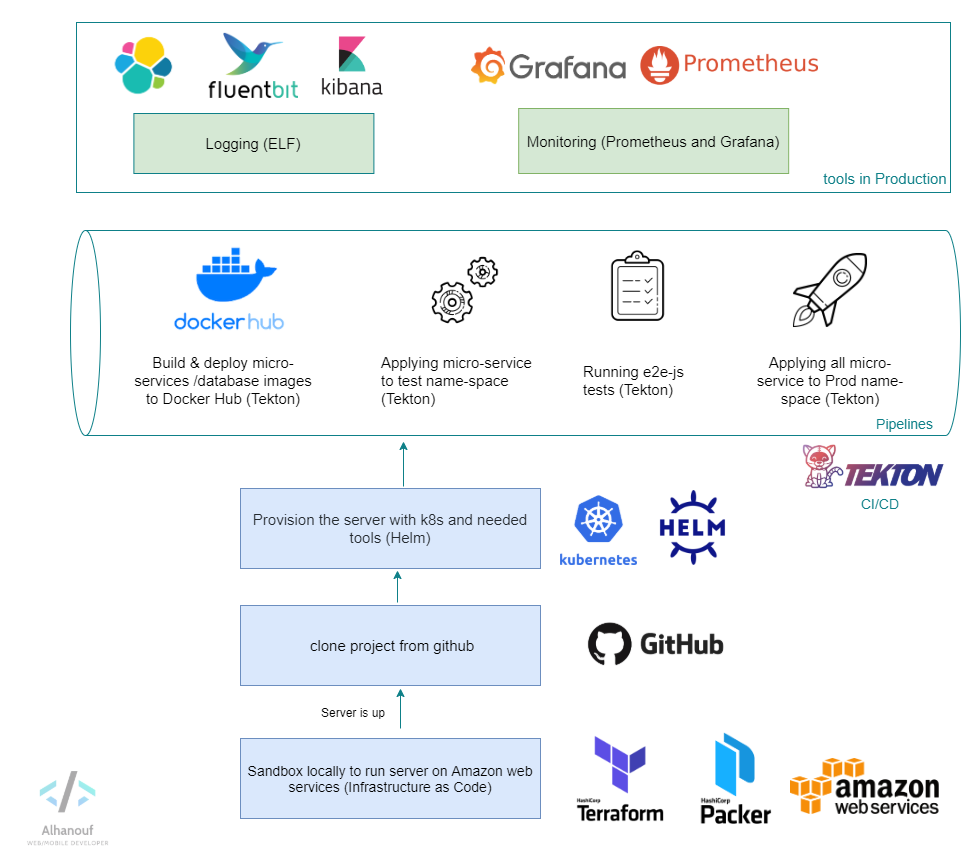
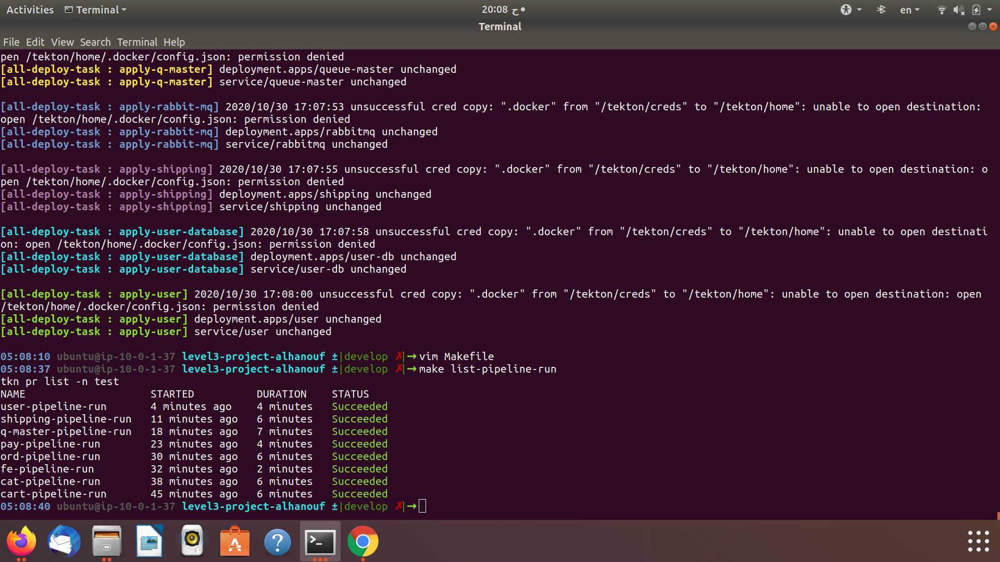
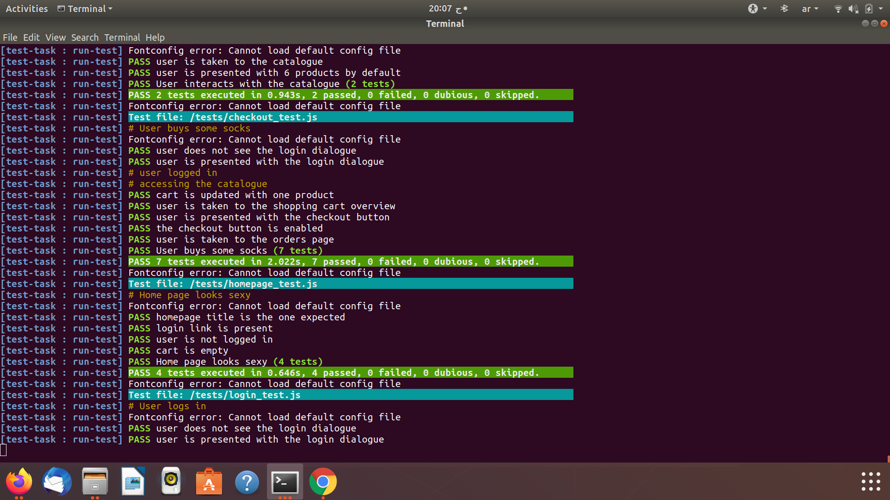
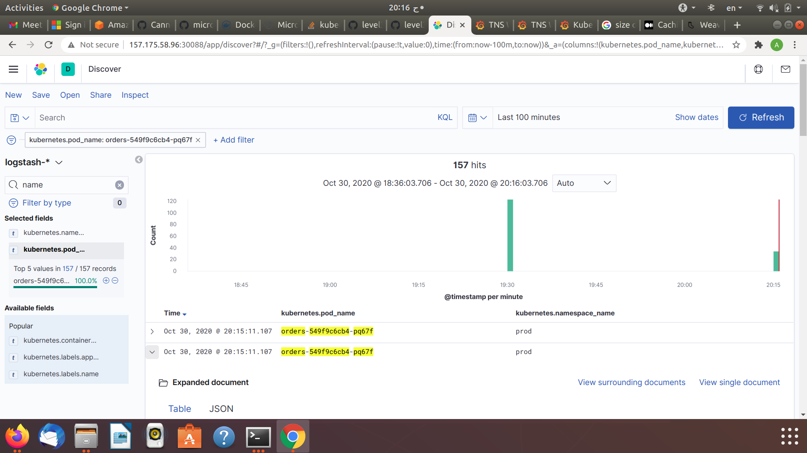
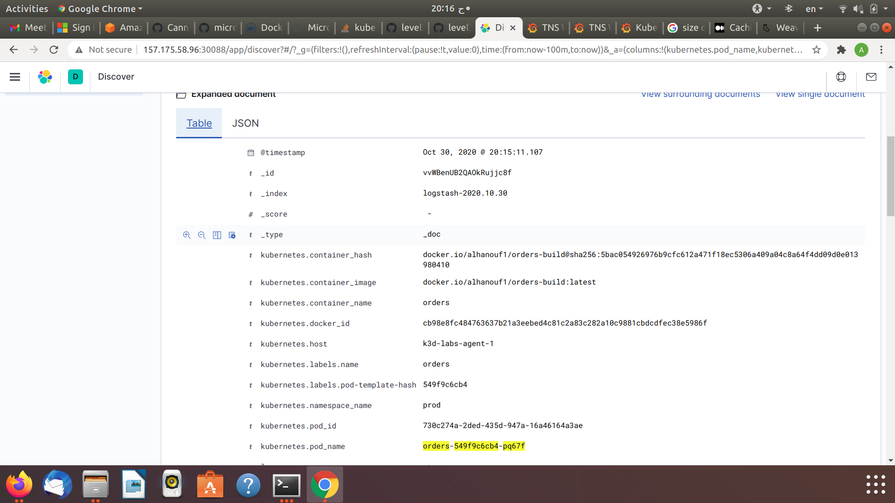
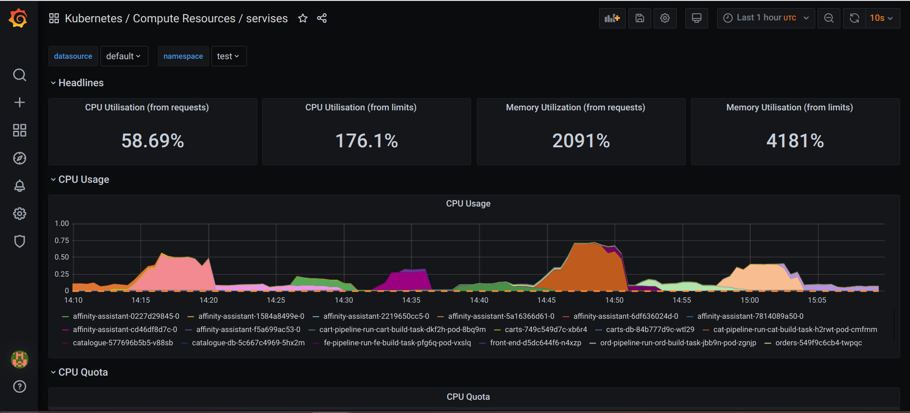

# DevOps Bootcamp Level 3 Final Project

## Capstone Project

We are demonstrating a near production-ready K8S platform hosting the Weaveworks Shock Shop demo. using kubernetes - Tekton - elf - prometheus and grafana

## Overall Structure of the project

## Architecture of Sock Shop

## Directories 
Each micro-service has it's own repo - there we have Dockerfile that will be used to build and run the images to docker hub

### Tekton 
- Contains clusterrole - clusterrole binding - service account

### Subdiectories
- Pipelines (*has the pipelines*)
- kaniko (*has build tasks*)
- test-deploy (*has all service and deployment files for the micro-services*)
	- subdiectories
	- deploy (*has tekton tasks for depolying the micro-services to name-space*)
	- test (*has tekton task for the test-task*)s
## Usage
- Go to K8s-sandbox make up (to bring up k8s and needed tools)

- Go back to the main directory (*level3-project-alhanouf*)
- docker login -u username (*enter your password*)
- make up

## Notes
Pipelines will run and perform the build and push image to dockerhub task , they will fail because not all services are running + we will have to run them again to do that do the following:

while in the main directory 
- make delete-pipeline-run 
- make delete-docker-sec
- make up 

## Pipelines structure 

Each micro-services has its own pipeline each will have 4 Tekton tasks except user & catalouge will have 5 steps (for building the db image)
- building the image and or db
- applying the micro-services to the test name-space 
- running the tests
- deplying the micro-services to prod name-space

### Pipeline runs 

### Tests passing

## Logging & monitoring 
- elf is in the logging namespace
- pro graf is in the monitor namespace 

### Logs 

## Dashboards

- Can be found in k8s-sandbox under json-dashboard folder
- To use them upload them into grafana

## More
 
- The tools can be accessed via Nodeport
- Explore the Makefile for more commands 

